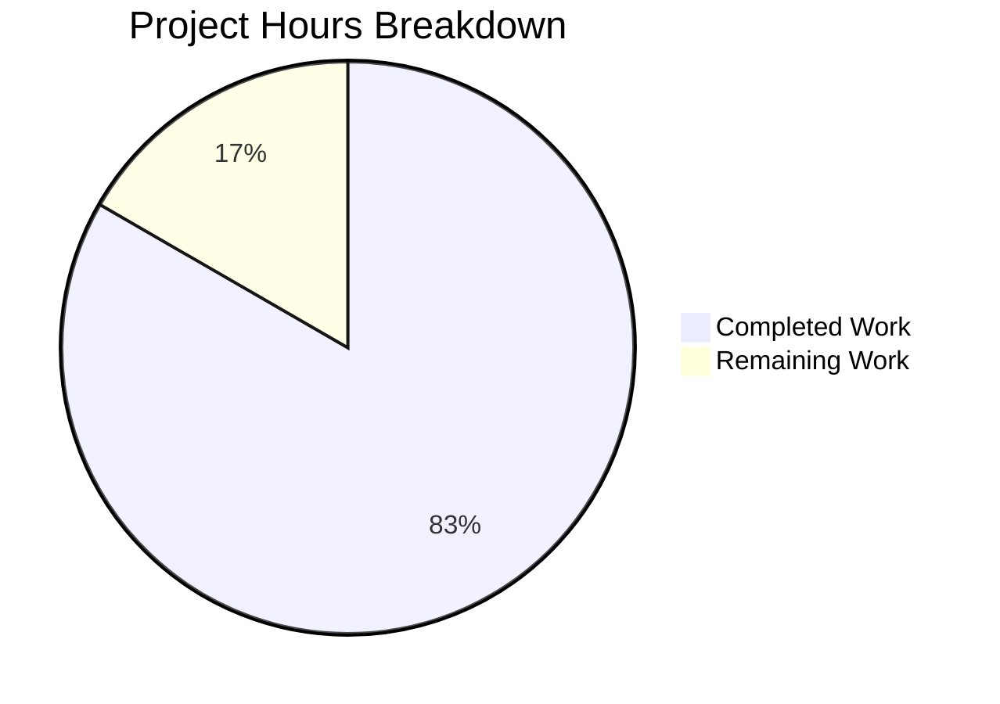
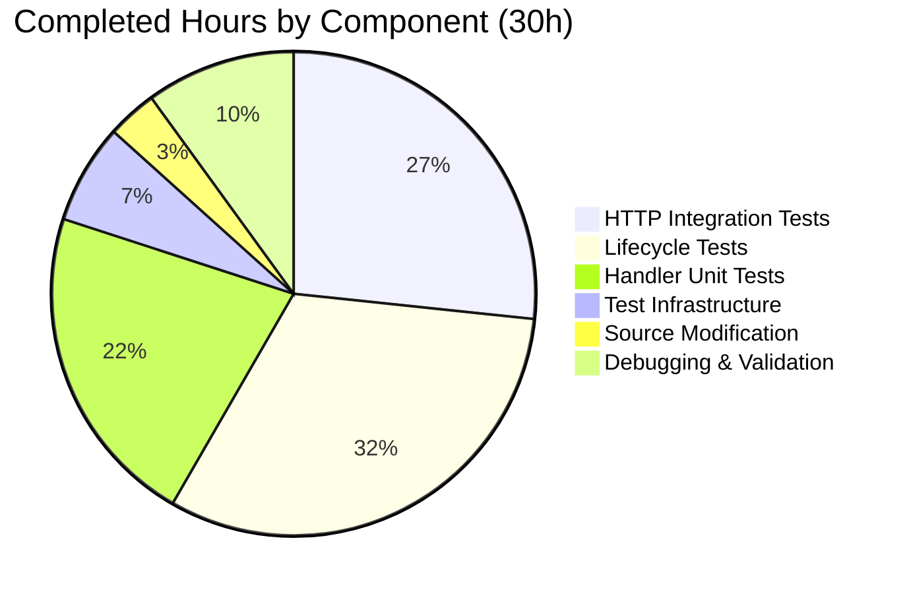

# Project Guide: Comprehensive Jest Test Suite for Node.js HTTP Server

## 1. Executive Summary

**Project Completion: 83% (30 hours completed out of 36 total hours)**

This project adds a comprehensive unit and integration test suite for `server.js` — a minimal, zero-dependency Node.js HTTP server that serves a deterministic `Hello, World!\n` response on `127.0.0.1:3000`. The test suite was built from scratch (greenfield) using Jest 30.x and Supertest 7.2.2, achieving **39 passing tests** with **100% code coverage** across all metrics.

### Key Achievements
- **All 6 AAP deliverables completed and verified:** 3 test files created, 1 config file created, 2 source files updated
- **39/39 tests passing** across 3 test suites (handler unit tests, HTTP integration tests, lifecycle tests)
- **100% coverage** — statements, branches, functions, and lines
- **0 security vulnerabilities** — npm audit clean after dependency overrides
- **Zero compilation errors** — all syntax checks pass
- **Minimal source modification** — only `module.exports = server;` added to server.js (no behavioral changes)

### Remaining Work (6 hours)
All in-scope AAP deliverables are complete. Remaining tasks are exclusively human review activities and items explicitly marked out-of-scope in the AAP but recommended for production readiness:
- Code review and PR merge approval
- Jest version deviation acknowledgment (30.x vs AAP-specified 29.7.0)
- README.md testing documentation
- CI/CD pipeline setup
- Package.json entry point mismatch fix

### Hours Calculation
- **Completed:** 30 hours (test infrastructure 2h + source modification 1h + HTTP integration tests 8h + lifecycle tests 9.5h + handler unit tests 6.5h + debugging/validation 3h)
- **Remaining:** 6 hours (after 1.21x enterprise multipliers applied to 5h base estimate)
- **Total:** 36 hours
- **Completion:** 30 / 36 = 83%

---

## 2. Validation Results Summary

### 2.1 Final Validator Outcome
The Final Validator agent confirmed **PRODUCTION-READY** status with zero issues found and zero fixes needed.

### 2.2 Compilation Results
| File | Status | Method |
|------|--------|--------|
| `server.js` | ✅ Pass | `node -c server.js` |
| `jest.config.js` | ✅ Pass | `node -c jest.config.js` |
| `package.json` | ✅ Pass | `JSON.parse()` validation |

### 2.3 Test Results — 39/39 PASSED (100%)

**Test Suites: 3 passed, 3 total | Tests: 39 passed, 39 total | Time: ~6.3s**

| Test File | Tests | Status | Focus Area |
|-----------|-------|--------|------------|
| `__tests__/server.handler.test.js` | 8/8 ✅ | Pass | Isolated handler unit tests (mock req/res) |
| `__tests__/server.test.js` | 20/20 ✅ | Pass | HTTP integration tests via Supertest |
| `__tests__/server.lifecycle.test.js` | 11/11 ✅ | Pass | Server startup, shutdown, EADDRINUSE errors |

**Test breakdown by category:**
- Happy path (GET /): 4 tests — status code, content-type, body, content-length
- HTTP methods: 6 tests — POST, PUT, DELETE, PATCH, OPTIONS, HEAD
- URL paths: 5 tests — /, /foo, /bar/baz, /nonexistent, /?query=value, deeply nested
- Edge cases: 5 tests — concurrent requests, large body, custom headers, byte length, 100 sequential
- Server startup: 2 tests — log message, clean exit
- Server binding: 2 tests — host:port, listening state
- Console output: 2 tests — message content, call count
- Server shutdown: 2 tests — close callback, listening=false
- EADDRINUSE: 1 test — port conflict error via child process
- Error event: 2 tests — listener management, http.Server instanceof
- Handler isolation: 8 tests — statusCode, setHeader, end, req ignored, sync, order, identical output

### 2.4 Coverage Results — 100% All Metrics
| File | Statements | Branches | Functions | Lines |
|------|-----------|----------|-----------|-------|
| `server.js` | 100% | 100% | 100% | 100% |

Jest enforces these thresholds via `jest.config.js` — the build will fail if coverage drops below 100% on any metric.

### 2.5 Dependency Status
- **Dependencies installed:** 304 packages (jest@30.2.0, supertest@7.2.2 + transitives)
- **Security audit:** 0 vulnerabilities (npm audit clean)
- **Dependency overrides applied:** minimatch@10.2.2, test-exclude@8.0.0, glob@13.0.6

### 2.6 Runtime Validation
- Server starts and binds to `127.0.0.1:3000` ✅
- Logs `Server running at http://127.0.0.1:3000/` to stdout ✅
- GET `/` returns `200 OK`, `Content-Type: text/plain`, body `Hello, World!\n` ✅
- POST and arbitrary paths return identical response ✅
- Server shuts down cleanly on SIGTERM ✅

### 2.7 Fixes Applied During Validation
No fixes were needed by the Final Validator. The following fixes were applied during implementation (prior to validation):
- **Commit `0e040eb`:** Added `--runInBand` to test script to resolve parallel execution EADDRINUSE failures
- **Commit `31e378d`:** Upgraded Jest to ^30.0.0 and added dependency overrides to resolve 3 security findings in transitive dependencies
- **Commit `415406c`:** Moved Jest config to a separate `jest.config.js` file per AAP specification

---

## 3. Visual Representation

### 3.1 Project Hours Breakdown



**Calculation:** 30 hours completed / (30 + 6) total hours = 83% complete

### 3.2 Completed Work Distribution



---

## 4. Development Guide

### 4.1 System Prerequisites

| Requirement | Version | Notes |
|-------------|---------|-------|
| Node.js | v20.x (tested on v20.19.5) | LTS recommended |
| npm | v10.x+ (tested on 10.8.2) | Ships with Node.js |
| Operating System | Windows, macOS, or Linux | Tested on Windows |
| Disk Space | ~50 MB | For node_modules |

### 4.2 Environment Setup

**Step 1: Clone the repository and switch to the feature branch**
```bash
git clone <repository-url>
cd <repository-name>
git checkout blitzy-04c0000e-2950-4d1f-8014-e54b300e20ac
```

**Step 2: Verify Node.js version**
```bash
node -v
# Expected output: v20.x.x (v20.19.5 or compatible)
```

No environment variables are required. The server uses hardcoded configuration (`127.0.0.1:3000`).

### 4.3 Dependency Installation

```bash
npm install
```

**Expected output:** 304 packages installed with 0 vulnerabilities.

**Verification:**
```bash
npm ls --depth=0
# Expected:
# hello_world@1.0.0
# ├── jest@30.2.0
# └── supertest@7.2.2
```

### 4.4 Running Tests

**Run full test suite with coverage:**
```bash
CI=true npm test
```

**Expected output:** 3 test suites, 39 tests passed, 100% coverage across all metrics.

**Run a specific test file:**
```bash
npx jest __tests__/server.test.js --verbose
npx jest __tests__/server.lifecycle.test.js --verbose
npx jest __tests__/server.handler.test.js --verbose
```

**Run a specific test by name:**
```bash
npx jest --testNamePattern="should return status code 200"
```

**Run tests with detailed coverage report:**
```bash
npx jest --runInBand --coverage --coverageReporters=text --verbose
```

### 4.5 Starting the Server

```bash
node server.js
# Expected output: Server running at http://127.0.0.1:3000/
```

**Verify the server is running:**
```bash
curl http://127.0.0.1:3000/
# Expected output: Hello, World!
```

Or in a browser, navigate to `http://127.0.0.1:3000/`.

### 4.6 Verification Steps

| Step | Command | Expected Result |
|------|---------|-----------------|
| Syntax check | `node -c server.js` | No output (success) |
| Config check | `node -c jest.config.js` | No output (success) |
| JSON validation | `node -e "JSON.parse(require('fs').readFileSync('package.json','utf-8'))"` | No error |
| Test suite | `CI=true npm test` | 39 passed, 0 failed |
| Coverage | Check `coverage/` directory after test run | 100% all metrics |
| Server start | `node server.js` | Logs startup message |
| HTTP response | `curl http://127.0.0.1:3000/` | `Hello, World!` |
| Security audit | `npm audit` | 0 vulnerabilities |

### 4.7 Project Structure

```
.
├── __tests__/
│   ├── server.test.js          # HTTP integration tests (20 tests)
│   ├── server.lifecycle.test.js # Lifecycle & error tests (11 tests)
│   └── server.handler.test.js   # Isolated handler unit tests (8 tests)
├── coverage/                    # Generated coverage reports (gitignored)
├── node_modules/                # Dependencies (gitignored)
├── jest.config.js               # Jest configuration
├── package.json                 # Project manifest with test script
├── package-lock.json            # Dependency lock file
├── README.md                    # Project readme
└── server.js                    # HTTP server source (16 lines)
```

### 4.8 Troubleshooting

| Issue | Cause | Solution |
|-------|-------|----------|
| `EADDRINUSE: address already in use :::3000` | Port 3000 occupied | Kill the process using port 3000: `lsof -ti:3000 \| xargs kill` or `netstat -ano \| findstr :3000` on Windows |
| Tests hang / don't exit | Jest watch mode active | Use `CI=true npm test` or add `--watchAll=false` flag |
| Tests fail with port conflicts | Parallel test execution | Tests already use `--runInBand`; verify no other server instance is running |
| Coverage below 100% | Test file not covering all lines | Run `npx jest --coverage --verbose` and check uncovered line numbers |

---

## 5. Detailed Task Table

All in-scope AAP deliverables are complete. The following tasks remain for human developers:

| # | Task | Description | Priority | Severity | Hours | Confidence |
|---|------|-------------|----------|----------|-------|------------|
| 1 | Code review and PR merge | Review 954 lines of test code across 3 files, verify test quality and patterns, approve and merge PR | High | Medium | 2.0 | High |
| 2 | Acknowledge Jest version deviation | AAP specified jest@29.7.0; agents installed jest@^30.0.0 (resolves to 30.2.0) to fix 3 security findings. Verify this is acceptable or pin to 29.7.0 if required | Medium | Low | 0.5 | High |
| 3 | Add testing documentation to README.md | Document test commands, coverage targets, and test architecture in README.md (explicitly out of scope per AAP §0.8.2 but recommended) | Low | Low | 1.0 | High |
| 4 | Set up CI/CD pipeline for automated testing | Configure GitHub Actions or similar to run `CI=true npm test` on PRs (explicitly out of scope per AAP §0.8.2 but recommended for production) | Low | Low | 2.0 | Medium |
| 5 | Fix package.json entry point mismatch | Change `"main": "index.js"` to `"main": "server.js"` or create `index.js` that requires server.js (explicitly out of scope per AAP §0.8.2, pre-existing issue) | Low | Low | 0.5 | High |
| | **Total Remaining Hours** | | | | **6.0** | |

**Note:** Tasks 3–5 are explicitly marked out-of-scope in AAP §0.8.2 but are included here as recommended production readiness improvements. Enterprise multipliers (1.10x compliance × 1.10x uncertainty = 1.21x) have been applied to the base estimate of 5 hours, yielding 6 hours total.

---

## 6. Risk Assessment

### 6.1 Technical Risks

| Risk | Severity | Likelihood | Impact | Mitigation |
|------|----------|------------|--------|------------|
| Jest 30.x breaking changes vs 29.7.0 | Low | Low | Tests may need adjustment if Jest 30 API differs | All 39 tests pass on Jest 30.2.0; API is backward-compatible. Task #2 addresses formal acknowledgment |
| Test port conflicts in CI environments | Low | Medium | EADDRINUSE failures if port 3000 is occupied | `--runInBand` flag serializes test execution; Supertest uses ephemeral ports for HTTP tests |
| Server auto-start on require() | Low | Low | Test leaks if afterAll hooks don't fire | All test files properly close server in afterAll hooks; verified by clean Jest exit |

### 6.2 Security Risks

| Risk | Severity | Likelihood | Impact | Mitigation |
|------|----------|------------|--------|------------|
| DevDependency vulnerabilities | Low | Low | Only affects development, not production | `npm audit` shows 0 vulnerabilities; `overrides` block pins secure versions of minimatch, test-exclude, glob |
| No HTTPS/TLS | Medium | N/A | Server binds to localhost only | Explicitly out of scope per tech spec §1.3; localhost-only binding limits exposure |

### 6.3 Operational Risks

| Risk | Severity | Likelihood | Impact | Mitigation |
|------|----------|------------|--------|------------|
| No CI/CD pipeline | Medium | High | Tests won't run automatically on PRs | Task #4 addresses this; currently tests must be run manually via `CI=true npm test` |
| No test documentation in README | Low | Medium | New developers won't discover test commands | Task #3 addresses this; commands are documented in this project guide |
| Package.json entry point mismatch | Low | Low | `require('hello_world')` would fail to find server | Pre-existing issue; server is started directly via `node server.js` |

### 6.4 Integration Risks

| Risk | Severity | Likelihood | Impact | Mitigation |
|------|----------|------------|--------|------------|
| Node.js version compatibility | Low | Low | Tests may behave differently on Node 18.x or 22.x | Jest 30.x supports Node 18.x+; server uses only built-in `http` module. Cross-version testing recommended |
| No external service dependencies | None | N/A | N/A | Server is fully self-contained with zero external dependencies |

### 6.5 Risk Summary
**Overall risk level: LOW.** The project is a minimal HTTP server with a comprehensive test suite. All tests pass, coverage is 100%, and there are no security vulnerabilities. The only medium-severity risks relate to operational improvements (CI/CD, documentation) that are explicitly out of scope per the AAP.

---

## 7. Git Commit History

| Hash | Author | Description |
|------|--------|-------------|
| `31e378d` | Blitzy Agent | fix(security): resolve 3 QA findings — upgrade jest to 30.x and add dependency overrides |
| `0e040eb` | Blitzy Agent | fix: add --runInBand to test script to resolve parallel execution EADDRINUSE failures |
| `3dcdb38` | Blitzy Agent | Add isolated request handler unit tests (__tests__/server.handler.test.js) |
| `5d1d7c8` | Blitzy Agent | Create __tests__/server.test.js — comprehensive HTTP response integration tests via Supertest |
| `d43cd84` | Blitzy Agent | Create __tests__/server.lifecycle.test.js — Server startup, shutdown, and error handling tests |
| `415406c` | Blitzy Agent | fix: create jest.config.js as separate file per AAP and remove duplicate jest config from package.json |
| `1ac9070` | Blitzy Agent | Address code review findings: restore jest inline config in package.json |
| `81e013d` | Blitzy Agent | Create jest.config.js and remove redundant jest key from package.json |
| `41c1cb5` | Blitzy Agent | Add module.exports = server to enable testability |
| `2483000` | Blitzy Agent | Add Jest configuration block to package.json |
| `6d736af` | Blitzy Agent | chore: add Jest and Supertest devDependencies, update test script |

**Total: 10 commits | 7 files changed | 5,559 lines added | 3 lines removed**

---

## 8. Files Changed Summary

| File | Action | Lines | Purpose |
|------|--------|-------|---------|
| `__tests__/server.test.js` | CREATED | 220 | HTTP integration tests via Supertest (20 tests) |
| `__tests__/server.lifecycle.test.js` | CREATED | 487 | Server lifecycle, shutdown, and error tests (11 tests) |
| `__tests__/server.handler.test.js` | CREATED | 247 | Isolated handler unit tests with mock objects (8 tests) |
| `jest.config.js` | CREATED | 32 | Jest configuration: node env, 100% coverage thresholds |
| `server.js` | MODIFIED | +2 lines | Added `module.exports = server;` for testability |
| `package.json` | MODIFIED | +12/-3 lines | Added devDependencies, test script, overrides |
| `package-lock.json` | MODIFIED | +4,559 lines | Regenerated with Jest/Supertest dependency tree |
